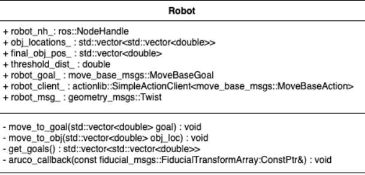

# Warehouse_Robots-808XFP

# ENPM 808X Final Project 

# WAREHOUSE ROBOT

# Team Members
 - Rishabh Singh (UID - 117511208)
 - Adithya Singh (UID - 117507047)
 - Divyansh Agarwal (UID - 117730692)

## Overview

The idea is related to collaborative robots or “cobots”. The mobile robots are designed to
help human workers perform diverse tasks in warehouse environments and may also have the 
capability of acting as a mobile storage bin for picked orders. They also have the capability
to navigate autonomously using various object detection, path planning, and perception
techniques. We are proposing to add these Autonomous Mobile Robots (AMRs) to the
portfolio of Acme Robotics

##### Algorithms to be utilised
1. Monte Carlo Localization: Used by the
ROS MoveBase package to localize the
robot in the map
2. A* algorithm: Used by ROS MoveBase
to plan paths
3. Perspective Projection: Used by ROS
ArUco detector package.

## UML Class Diagram

 

## Sprints and Backlogs
For this project Agile Iterative Process techniques were followed.
Sprint URL : [Sprint](https://docs.google.com/document/d/1i9uSZZQ_sIx2-5LxqOqx3VeSwF30iu6E4vHWd2NctFc/edit?usp=sharing)
Product & Interation Backlog : [ProductBCK](https://docs.google.com/spreadsheets/d/1FPVZE-TKWvhRZL-aQ01Hb0Aypjf1ur8BYXQdcFjWHR4/edit?usp=sharing_eil_se_dm&ts=638a8056)

## TDD and AIP Utilisation 
#### Phase 1
 - **Driver** : Rishabh Singh (UID - 117511208)
 - **Navigator** : Adithya Singh (UID - 117507047)
 - **UML Design Kepeer** : Divyansh Agarwal (UID - 117730692)

#### Phase 2
 - **Navigator** : Rishabh Singh (UID - 117511208)
 - **UML Design Keeper** : Adithya Singh (UID - 117507047)
 - **Driver** : Divyansh Agarwal (UID - 117730692)

#### Phase 3
 - **Navigator** : Rishabh Singh (UID - 117511208)
 - **Driver** : Adithya Singh (UID - 117507047)
 - **UML Design Keeper** : Divyansh Agarwal (UID - 117730692)