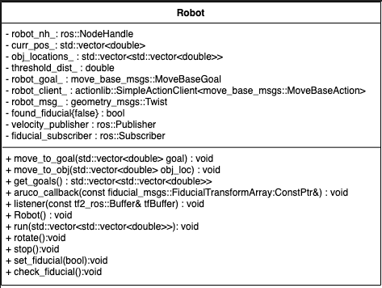
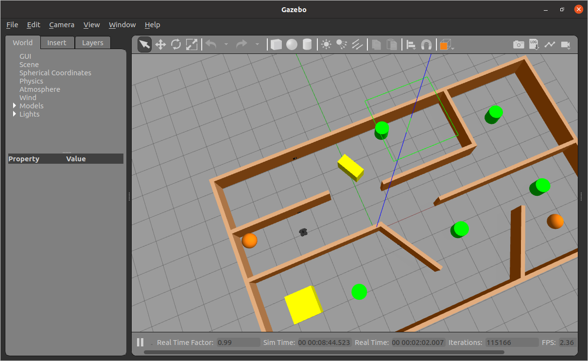
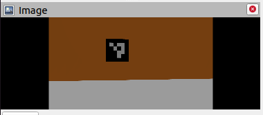
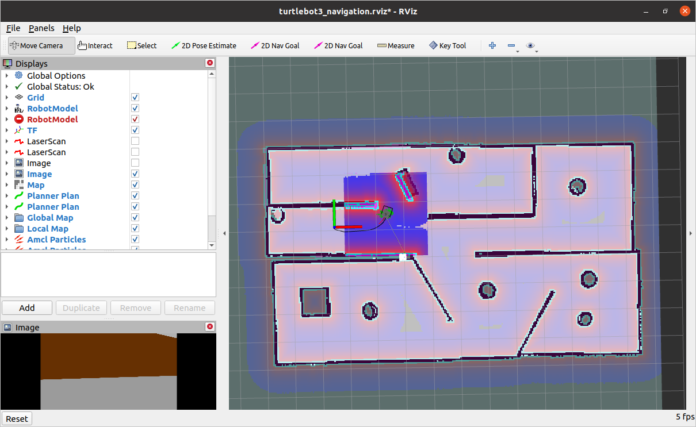
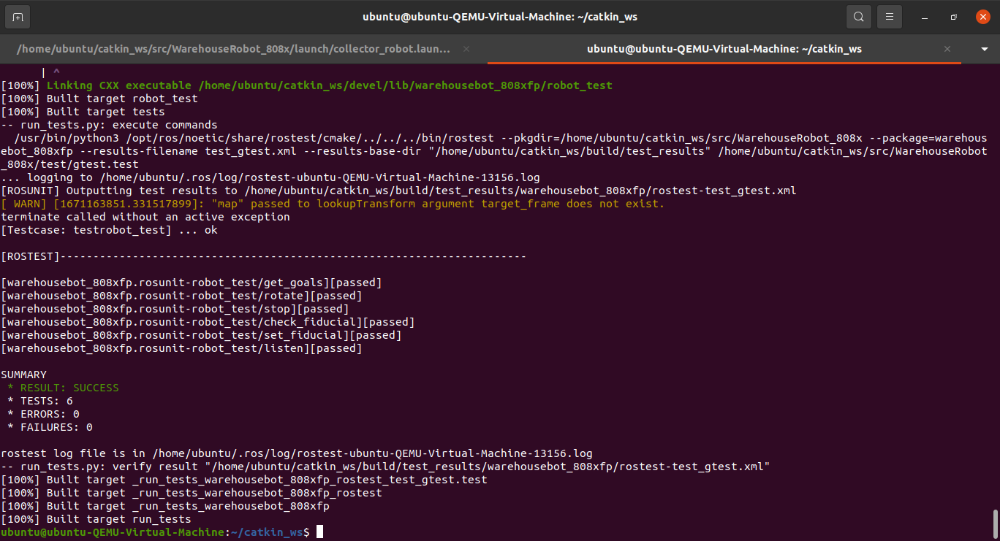

# Warehouse_Robots-808XFP

[](https://github.com/rish2911/WarehouseRobot_808x/actions/workflows/build_and_coveralls.yml)
[](https://coveralls.io/github/rish2911/WarehouseRobot_808x?branch=master)
[](https://opensource.org/licenses/MIT)


# ENPM 808X Final Project 

# WAREHOUSE ROBOT

# Team Members
 - Rishabh Singh (UID - 117511208)
 - Adithya Singh (UID - 117507047)
 - Divyansh Agarwal (UID - 117730692)

## Overview

The idea is related to collaborative robots or “cobots”. The mobile robots are designed to
help human workers perform diverse tasks in warehouse environments and may also have the 
capability of acting as a mobile storage bin for picked orders. They also have the capability
to navigate autonomously using various object detection, path planning, and perception
techniques. We are proposing to add these Autonomous Mobile Robots (AMRs) to the
portfolio of Acme Robotics

##### Algorithms to be utilised
1. Monte Carlo Localization: Used by the
    ROS MoveBase package to localize the
    robot in the map

2. A* algorithm: Used by ROS MoveBase
    to plan paths

3. Perspective Projection: Used by ROS
    ArUco detector package.

  

## UML Class Diagram

 


## Deliverables

ROS Noetic

ROS Turtlebot

ROS tf2

Move_base

Gazebo

GTest

## Presentation

Presentation for the project can be found [here](https://docs.google.com/presentation/d/1_e78B4SrzGTfF2D9c6sEA-Uq1oBwtH2_YkdMxTQ5JZk/edit?usp=sharing)

## Sprints and Backlogs

For this project Agile Iterative Process techniques were followed.
Sprint URL : [Sprint](https://docs.google.com/document/d/1i9uSZZQ_sIx2-5LxqOqx3VeSwF30iu6E4vHWd2NctFc/edit?usp=sharing)
Product & Interation Backlog : [ProductBCK](https://docs.google.com/spreadsheets/d/1FPVZE-TKWvhRZL-aQ01Hb0Aypjf1ur8BYXQdcFjWHR4/edit?usp=sharing_eil_se_dm&ts=638a8056)

## World

Following is the Gazebo world used for this project 



This project needs Aruco markers to denote objects to be collected, following is the aruco marker as viewed by the robot.



RVIZ visualization




## TDD and AIP Utilisation 

#### Phase 1
 - **Driver** : Rishabh Singh (UID - 117511208)
 - **Navigator** : Adithya Singh (UID - 117507047)
 - **UML Design Kepeer** : Divyansh Agarwal (UID - 117730692)


#### Phase 2
 - **Navigator** : Rishabh Singh (UID - 117511208)
 - **UML Design Keeper** : Adithya Singh (UID - 117507047)
 - **Driver** : Divyansh Agarwal (UID - 117730692)

#### Phase 3
 - **Navigator** : Rishabh Singh (UID - 117511208)
 - **Driver** : Adithya Singh (UID - 117507047)
 - **UML Design Keeper** : Divyansh Agarwal (UID - 117730692)

## Installation

Create a ROS workspace and clone the repository

```bash
mkdir -p ~/catkin_ws/src
cd ~/catkin_ws/src
git clone https://github.com/rish2911/WarehouseRobot_808x
cd WarehouseRobot_808x
```

Install requirements

```bash
bash script/install.bash
```

Build the package

```bash
cd ~/catkin_ws
catkin_make clean
catkin_make
source devel/setup.bash
```

Run the Gazebo client to execute simulator

```bash
export GAZEBO_MODEL_PATH=$GAZEBO_MODEL_PATH:~/catkin_ws/src/WarehouseRobot_808x/models
roslaunch warehousebot_808xfp collector_robot.launch
```

Open a new terminal to run the collector robot node

```bash
source devel/setup.bash
rosrun warehousebot_808xfp warehousebot_808xfp_node
```


## Results

Following is the output on command line


## Testing

To test the package 

```bash
export GAZEBO_MODEL_PATH=$GAZEBO_MODEL_PATH:~/catkin_ws/src/WarehouseRobot_808x/models
roslaunch warehousebot_808xfp collector_robot.launch
```

Open a new terminal to run the tests

```bash
cd ~/catkin_ws
catkin_make
source devel/setup.bash
catkin_make run_tests
```

Following are the testing results



